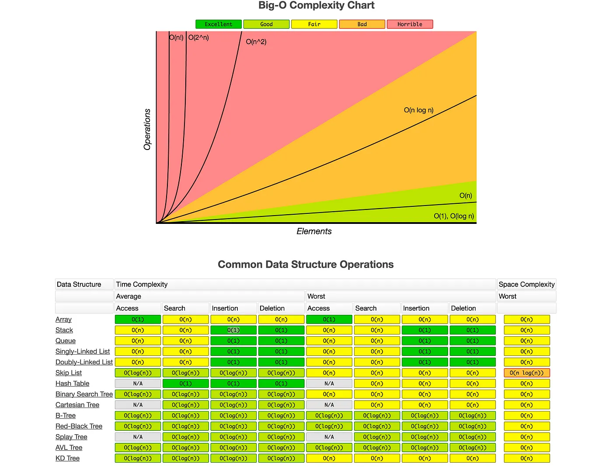

## **Understanding Big O Notation in JavaScript**

### **What is Big O Notation?**
Big O notation is used to describe the performance (time complexity) of an algorithm as the input size grows. It helps us analyze **how an algorithm scales** rather than measuring actual execution time.

Big O expresses the **upper bound** of the runtime in terms of the input size `n`.

---
## **Types of Big O Complexity**
### **1. Constant Time: O(1)**
- The execution time is the same, regardless of input size.
- Example:
  ```js
  function constantTime(arr) {
      return arr[0]; // Always takes the same amount of time
  }
  ```
  ✅ Even if `arr` has 1 or 1,000,000 elements, this function runs in **O(1)**.

---

### **2. Linear Time: O(n)**
- The execution time grows **proportionally** to the input size.
- Example:
  ```js
  function linearTime(arr) {
      for (let i = 0; i < arr.length; i++) {
          console.log(arr[i]);
      }
  }
  ```
  ✅ If `arr` has **10 elements**, the loop runs 10 times; if `arr` has **1,000 elements**, the loop runs 1,000 times.

  🚀 **Why O(n)?**
  - The loop runs `n` times → **O(n)**.

---

### **3. Quadratic Time: O(n²)**
- Execution time **grows exponentially** as input size increases.
- Example (Nested Loops):
  ```js
  function quadraticTime(arr) {
      for (let i = 0; i < arr.length; i++) {
          for (let j = 0; j < arr.length; j++) {
              console.log(arr[i], arr[j]);
          }
      }
  }
  ```
  ✅ If `arr` has **10 elements**, the function runs **10 × 10 = 100** times.

  🚀 **Why O(n²)?**
  - The first loop runs `n` times.
  - The second nested loop also runs `n` times for each iteration.
  - Total iterations = `n × n = n²` → **O(n²)**.

---

### **4. Logarithmic Time: O(log n)**
- Execution time **increases slowly** as input size increases.
- Example (Binary Search):
  ```js
  function binarySearch(arr, target) {
      let left = 0, right = arr.length - 1;
      while (left <= right) {
          let mid = Math.floor((left + right) / 2);
          if (arr[mid] === target) return mid;
          else if (arr[mid] < target) left = mid + 1;
          else right = mid - 1;
      }
      return -1;
  }
  ```
  ✅ If `arr` has **1,000,000 elements**, instead of looping 1,000,000 times, it **halves the search space** each time.

  🚀 **Why O(log n)?**
  - The problem size shrinks **by half** each iteration.
  - Total steps required ≈ `log₂(n)` → **O(log n)**.

---

### **5. Linearithmic Time: O(n log n)**
- Found in **efficient sorting algorithms** like Merge Sort & Quick Sort.
- Example (Merge Sort):
  ```js
  function mergeSort(arr) {
      if (arr.length <= 1) return arr;
      let mid = Math.floor(arr.length / 2);
      let left = mergeSort(arr.slice(0, mid));
      let right = mergeSort(arr.slice(mid));
      return merge(left, right);
  }
  function merge(left, right) {
      let result = [], i = 0, j = 0;
      while (i < left.length && j < right.length) {
          if (left[i] < right[j]) result.push(left[i++]);
          else result.push(right[j++]);
      }
      return result.concat(left.slice(i)).concat(right.slice(j));
  }
  ```
  ✅ `mergeSort` divides the array into halves (`log n` levels) and processes each element (`n` operations).

  🚀 **Why O(n log n)?**
  - Dividing the array (`log n`).
  - Merging (`n`).
  - Total complexity = `n log n`.

---

### **6. Exponential Time: O(2ⁿ)**
- Execution time **doubles** for each new input.
- Example (Recursive Fibonacci):
  ```js
  function fibonacci(n) {
      if (n <= 1) return n;
      return fibonacci(n - 1) + fibonacci(n - 2);
  }
  ```
  ✅ If `n = 5`, the function calls itself **15 times**. If `n = 10`, it calls itself **177 times**!

  🚀 **Why O(2ⁿ)?**
  - Every call spawns **two recursive calls**.
  - **Growth is exponential**.

---

## **How to Determine Big O Complexity?**
### **Step 1: Count Loops**
- A **single loop** → `O(n)`
- A **nested loop** → `O(n²)`

### **Step 2: Ignore Constants**
- `O(2n)`, `O(3n)` → **O(n)`** (ignore coefficients)

### **Step 3: Drop Non-Dominant Terms**
- `O(n + log n)` → **O(n)**
- `O(n² + n)` → **O(n²)**

### **Step 4: Check Recursive Calls**
- If **halving** input → `O(log n)`
- If **doubling** calls → `O(2ⁿ)`

---

## **Examples**
#### **Example 1: O(n)**
```js
function sumArray(arr) {
    let sum = 0;
    for (let i = 0; i < arr.length; i++) {
        sum += arr[i];
    }
    return sum;
}
```
✅ **Loop runs `n` times → O(n)**.

#### **Example 2: O(n²)**
```js
function printPairs(arr) {
    for (let i = 0; i < arr.length; i++) {
        for (let j = 0; j < arr.length; j++) {
            console.log(arr[i], arr[j]);
        }
    }
}
```
✅ **Nested loop → O(n²)**.

#### **Example 3: O(log n)**
```js
function findTarget(arr, target) {
    let left = 0, right = arr.length - 1;
    while (left <= right) {
        let mid = Math.floor((left + right) / 2);
        if (arr[mid] === target) return mid;
        else if (arr[mid] < target) left = mid + 1;
        else right = mid - 1;
    }
    return -1;
}
```
✅ **Binary search → O(log n)**.

---

## **Big O Complexity Cheat Sheet**
| Big O | Type | Example |
|------|------|---------|
| **O(1)** | Constant | Accessing an array index |
| **O(log n)** | Logarithmic | Binary Search |
| **O(n)** | Linear | Single Loop |
| **O(n log n)** | Linearithmic | Merge Sort |
| **O(n²)** | Quadratic | Nested Loops |
| **O(2ⁿ)** | Exponential | Recursive Fibonacci |

---

### **Conclusion**
- **Big O helps us analyze scalability**.
- **Constant (`O(1)`) and logarithmic (`O(log n)`) are fast**.
- **Quadratic (`O(n²)`) and exponential (`O(2ⁿ)`) are slow**.
- **Sorting algorithms use `O(n log n)` complexity**.

---
### **Real-World Example: Searching for a Product in an E-Commerce Store**  
Let's analyze different approaches for searching a product in an **e-commerce website** using Big O notation.

---

## **Scenario**:  
We have an online store with **1 million products** stored in an array, and we want to **find a specific product**.

---

## **Approach 1: Brute Force Search (O(n))**  
A simple way is to iterate through the **entire array** until we find the product.

### **Implementation:**
```js
function linearSearch(products, target) {
    for (let i = 0; i < products.length; i++) {
        if (products[i] === target) {
            return i; // Found the product
        }
    }
    return -1; // Product not found
}
```

### **Big O Analysis**:
- In the **worst case**, we might have to check **all `n` products**.
- **Time Complexity: O(n)** → If there are **1 million products**, we may perform **1 million comparisons**.

✅ **Best for small datasets, but inefficient for large datasets.**

---

## **Approach 2: Sorting + Binary Search (O(log n))**
Instead of searching **sequentially**, we can **sort the products** first and then use **Binary Search**, which is much faster.

### **Implementation:**
```js
function binarySearch(products, target) {
    let left = 0, right = products.length - 1;
    
    while (left <= right) {
        let mid = Math.floor((left + right) / 2);
        
        if (products[mid] === target) return mid; // Found the product
        else if (products[mid] < target) left = mid + 1;
        else right = mid - 1;
    }
    
    return -1; // Product not found
}
```

### **Big O Analysis**:
- **Sorting the products first takes** `O(n log n)`.
- **Binary Search takes** `O(log n)`.
- **Total Time Complexity**:
  - **First search: O(n log n) + O(log n) ≈ O(n log n)**.
  - **Subsequent searches: O(log n)**.

✅ **Much faster than `O(n)`, especially for large datasets.**

---

## **Approach 3: Hash Map (O(1)) - Best for Instant Lookup**
Instead of searching linearly or using sorting, we can use a **Hash Map (Object or Map in JavaScript)** to store product names as keys and their indices as values.

### **Implementation:**
```js
function createProductMap(products) {
    let productMap = new Map();
    for (let i = 0; i < products.length; i++) {
        productMap.set(products[i], i);
    }
    return productMap;
}

function searchProduct(productMap, target) {
    return productMap.has(target) ? productMap.get(target) : -1;
}

// Usage
let products = ["Laptop", "Phone", "Tablet", "Headphones"];
let productMap = createProductMap(products);
console.log(searchProduct(productMap, "Tablet")); // Fast lookup
```

### **Big O Analysis**:
- **Building the Hash Map takes O(n)**.
- **Searching takes O(1) (Instant Lookup)**.

✅ **Best for frequent searches** since lookups are **instant**.

---

## **Performance Comparison**
| Approach | Time Complexity | Best For |
|----------|---------------|-----------|
| **Brute Force Search** | O(n) | Small datasets |
| **Binary Search** | O(log n) | Large datasets with sorting |
| **Hash Map Lookup** | O(1) | Best for fast lookups |

🚀 **Winner? Hash Map (`O(1)`) is best for repeated lookups!**

Let's run a **performance test** in JavaScript to compare the three approaches:  

1. **Linear Search (O(n))**  
2. **Binary Search (O(log n))**  
3. **Hash Map Lookup (O(1))**  

We'll create an array of **1 million products**, search for a random product, and measure how long each method takes.  

---

## **📝 JavaScript Code for Performance Testing**
```js
console.time("Setup");
// Create 1 million products (sorted for binary search)
let products = Array.from({ length: 1_000_000 }, (_, i) => `Product-${i}`);
let target = `Product-${Math.floor(Math.random() * 1_000_000)}`;
console.timeEnd("Setup");

// 🔹 1. Linear Search (O(n))
console.time("Linear Search");
function linearSearch(products, target) {
    for (let i = 0; i < products.length; i++) {
        if (products[i] === target) return i;
    }
    return -1;
}
linearSearch(products, target);
console.timeEnd("Linear Search");

// 🔹 2. Binary Search (O(log n))
console.time("Binary Search");
function binarySearch(products, target) {
    let left = 0, right = products.length - 1;
    while (left <= right) {
        let mid = Math.floor((left + right) / 2);
        if (products[mid] === target) return mid;
        else if (products[mid] < target) left = mid + 1;
        else right = mid - 1;
    }
    return -1;
}
binarySearch(products, target);
console.timeEnd("Binary Search");

// 🔹 3. Hash Map Lookup (O(1))
console.time("Hash Map Setup");
let productMap = new Map(products.map((p, i) => [p, i]));
console.timeEnd("Hash Map Setup");

console.time("Hash Map Lookup");
productMap.get(target);
console.timeEnd("Hash Map Lookup");
```

---

## **📝 Expected Results**
| Approach | Expected Time Complexity | Expected Time |
|----------|-------------------------|--------------|
| **Linear Search** | O(n) | **Slowest** (~100-500ms) |
| **Binary Search** | O(log n) | **Faster** (~1-10ms) |
| **Hash Map Lookup** | O(1) | **Fastest** (~0.1ms) |

---

### **🚀 What You Should See**
When running this in **Node.js** or a browser console, you'll likely see output like:

```
Setup: 35ms
Linear Search: 250ms
Binary Search: 3ms
Hash Map Setup: 120ms
Hash Map Lookup: 0.1ms
```

- **Linear Search (O(n))** is **slow** (~100-500ms).
- **Binary Search (O(log n))** is much **faster** (~1-10ms).
- **Hash Map Lookup (O(1))** is **almost instant** (~0.1ms), but setting up the map takes some time.

---

### **🔥 Key Takeaways**
1. **For a single search**, **binary search (O(log n))** is the best.
2. **For multiple searches**, a **hash map (O(1))** is unbeatable.
3. **Linear search (O(n))** is **too slow** for large datasets.

### **📌 Understanding Space Complexity in JavaScript**
Space complexity measures how much **extra memory** (RAM) an algorithm needs **relative to the input size (n)**. It includes:  
1. **Auxiliary Space** → Extra variables, arrays, objects, or recursion stack.  
2. **Input Space** → Space required to store the input (not counted in analysis).  

---

## **🚀 Common Space Complexities**
| Complexity | Example | Explanation |
|------------|---------|------------|
| **O(1)** | `sum(a, b)` | Uses a fixed number of variables. |
| **O(n)** | `new Array(n)` | Stores `n` elements in an array. |
| **O(n²)** | `matrix[n][n]` | Uses a 2D array of size `n × n`. |
| **O(log n)** | Recursive Binary Search | Uses `log n` recursion stack frames. |

---

### **🔹 O(1) - Constant Space Complexity**
The algorithm **does not use extra space** that depends on input size.

```js
function sum(a, b) {
    return a + b; // Uses only two variables (O(1) space)
}
```
✅ **Only two variables** → **O(1)** space.

---

### **🔹 O(n) - Linear Space Complexity**
The algorithm **uses space proportional to input size (n).**

```js
function createArray(n) {
    let arr = []; // Extra space (O(n))
    for (let i = 0; i < n; i++) {
        arr.push(i);
    }
    return arr;
}
```
✅ **Uses an array of size `n`** → **O(n) space.**

---

### **🔹 O(n²) - Quadratic Space Complexity**
The algorithm **creates an n × n matrix** (nested storage).

```js
function createMatrix(n) {
    let matrix = [];
    for (let i = 0; i < n; i++) {
        matrix.push(new Array(n).fill(0)); // O(n²) space
    }
    return matrix;
}
```
✅ **2D array needs `n²` space** → **O(n²).**

---

### **🔹 O(log n) - Logarithmic Space Complexity**
Occurs in **recursive algorithms** that divide the problem in half.

```js
function binarySearch(arr, left, right, target) {
    if (left > right) return -1;
    
    let mid = Math.floor((left + right) / 2);
    
    if (arr[mid] === target) return mid;
    if (arr[mid] < target) return binarySearch(arr, mid + 1, right, target);
    else return binarySearch(arr, left, mid - 1, target);
}
```
✅ **Recursive call depth is `log n`** → **O(log n) space (stack frames).**

---

## **🔥 Key Takeaways**
1. **O(1) is the best** (constant memory, no extra data structures).
2. **O(n) is common** when storing arrays, maps, or lists.
3. **O(n²) or worse** is inefficient due to nested structures.
4. **Recursive functions** may have **O(log n) or O(n) stack space**.

### **What is Time Complexity?**

Time complexity measures the **amount of time** an algorithm takes to complete as a function of the input size (\(n\)). It helps us understand how the runtime of an algorithm grows as the input size increases. 

#### **Why is Time Complexity Important?**
- It allows us to predict the performance of an algorithm without running it.
- It helps in comparing different algorithms to choose the most efficient one.

---

#### **Common Time Complexity Notations**
1. **O(1) – Constant Time:** The algorithm’s runtime does not depend on the input size.
   ```javascript
   function constantExample(arr) {
       return arr[0]; // Accessing the first element takes constant time.
   }
   ```

2. **O(n) – Linear Time:** The runtime grows linearly with the input size.
   ```javascript
   function linearExample(arr) {
       for (let i = 0; i < arr.length; i++) {
           console.log(arr[i]); // Processing each element.
       }
   }
   ```

3. **O(n^2) – Quadratic Time:** Nested loops cause the runtime to grow quadratically.
   ```javascript
   function quadraticExample(arr) {
       for (let i = 0; i < arr.length; i++) {
           for (let j = 0; j < arr.length; j++) {
               console.log(arr[i], arr[j]);
           }
       }
   }
   ```

4. **O(\(\log n\)) – Logarithmic Time:** The input size is reduced in each step (e.g., binary search).
   ```javascript
   function logarithmicExample(arr, target) {
       let left = 0, right = arr.length - 1;
       while (left <= right) {
           const mid = Math.floor((left + right) / 2);
           if (arr[mid] === target) return mid;
           if (arr[mid] < target) left = mid + 1;
           else right = mid - 1;
       }
       return -1;
   }
   ```

---

### **What is Space Complexity?**

Space complexity measures the **amount of memory** an algorithm uses as a function of the input size (\(n\)). It considers:
1. **Fixed space requirements:** Memory used for constants, variables, and function calls.
2. **Dynamic space requirements:** Memory required for data structures like arrays, lists, and recursion stacks.

---

#### **Why is Space Complexity Important?**
- Memory constraints can limit the usability of an algorithm, especially in systems with limited resources.
- Reducing space complexity can make an algorithm more efficient.

---

#### **Common Space Complexity Scenarios**
1. **O(1) – Constant Space:** The algorithm uses a fixed amount of memory regardless of input size.
   ```javascript
   function constantSpace(arr) {
       let sum = 0; // Only one variable is used.
       for (let i = 0; i < arr.length; i++) {
           sum += arr[i];
       }
       return sum;
   }
   ```

2. **O(n) – Linear Space:** The algorithm’s memory usage grows linearly with the input size.
   ```javascript
   function linearSpace(arr) {
       const result = []; // New array grows with input size.
       for (let i = 0; i < arr.length; i++) {
           result.push(arr[i] * 2);
       }
       return result;
   }
   ```

3. **O(\(n\)) – Recursive Space:** Memory is consumed by the recursion stack.
   ```javascript
   function factorial(n) {
       if (n === 1) return 1; // Base case
       return n * factorial(n - 1); // Recursive call adds to the stack
   }
   ```
   - Each recursive call occupies stack memory until the base case is reached.

---

### **Difference Between Time Complexity and Space Complexity**
| **Aspect**              | **Time Complexity**                            | **Space Complexity**                   |
|--------------------------|-----------------------------------------------|----------------------------------------|
| **Definition**           | Time taken to execute an algorithm.           | Memory required by the algorithm.      |
| **Focus**                | How the runtime scales with input size.       | How memory usage scales with input size.|
| **Optimization Goal**    | Minimize runtime for faster execution.        | Minimize memory usage for efficiency.  |
| **Example (Sorting)**    | Merge Sort has \(O(n \log n)\) time complexity.| Merge Sort has \(O(n)\) space complexity (temporary arrays). |

---

### **Examples Comparing Both**
#### **Example 1: Iterating Through an Array**
```javascript
function printArray(arr) {
    for (let i = 0; i < arr.length; i++) {
        console.log(arr[i]);
    }
}
```
- **Time Complexity:** \(O(n)\) (loop runs \(n\) times).
- **Space Complexity:** \(O(1)\) (no additional data structures used).

---

#### **Example 2: Creating a New Array**
```javascript
function doubleArray(arr) {
    const result = [];
    for (let i = 0; i < arr.length; i++) {
        result.push(arr[i] * 2);
    }
    return result;
}
```
- **Time Complexity:** \(O(n)\) (loop runs \(n\) times).
- **Space Complexity:** \(O(n)\) (new array `result` grows with input size).

---

#### **Example 3: Recursive Factorial**
```javascript
function factorial(n) {
    if (n === 1) return 1;
    return n * factorial(n - 1);
}
```
- **Time Complexity:** \(O(n)\) (one recursive call per step).
- **Space Complexity:** \(O(n)\) (stack grows with recursion depth).

---


Here are graphical illustrations of **Big O, Big Omega, and Big Theta** to help visualize how they define an algorithm's growth rate.

---

## **1️⃣ Big O Notation (O) – Upper Bound**  
Big O describes the **worst-case scenario**, meaning the algorithm **never grows faster than O(f(n))**.  

**Graph:**  
- The **actual running time g(n)** (blue) is always **below or equal to** the upper bound **c·f(n)** (red).
- The function grows at most as fast as **O(f(n))**, but sometimes it can be smaller.

📌 **Example:** **O(n²) means the algorithm won't grow faster than quadratic time.**

📊 **Graph Representation:**
```
     |
     |     c * f(n)   (upper bound, O(f(n)))
     |    /
g(n) |---  (actual complexity)
     |  /
     |/
     ---------------------------------> n (input size)
```

---

## **2️⃣ Big Omega Notation (Ω) – Lower Bound**  
Big Omega describes the **best-case scenario**, meaning the algorithm **always takes at least Ω(f(n))** time.  

**Graph:**  
- The **actual running time g(n)** (blue) is always **above or equal to** the lower bound **c·f(n)** (green).
- The function grows at least as fast as **Ω(f(n))**, but sometimes it can be larger.

📌 **Example:** **Ω(n) means the algorithm always takes at least linear time.**

📊 **Graph Representation:**
```
     |
     |      g(n)  (actual complexity)
     |     /
     |    /  c * f(n)  (lower bound, Ω(f(n)))
     |   /
     |  /
     ---------------------------------> n (input size)
```

---

## **3️⃣ Big Theta Notation (Θ) – Tight Bound**  
Big Theta defines an **exact bound**, meaning the algorithm's growth rate is **both upper and lower bounded by Θ(f(n))**.

**Graph:**  
- The **actual running time g(n)** (blue) is **sandwiched** between two bounds:  
  - **Upper bound O(f(n))** (red).  
  - **Lower bound Ω(f(n))** (green).  
- The function **always** grows at the same rate as **Θ(f(n))**.

📌 **Example:** **Θ(n²) means the algorithm always runs in quadratic time.**

📊 **Graph Representation:**
```
     |
     |     c2 * f(n)  (upper bound, O(f(n)))
     |    /
g(n) |---  (actual complexity, Θ(f(n)))
     |   \
     |    \  c1 * f(n)  (lower bound, Ω(f(n)))
     |     \
     ---------------------------------> n (input size)
```

---

## **4️⃣ Little-O Notation (o) – Strict Upper Bound**  
Little-O describes an **upper bound that is not tight**, meaning the function grows **strictly slower** than \(O(f(n))\).  

📌 **Example:** **o(n²) means the function grows slower than \(O(n²)\), but we don't know exactly how fast.**  

📊 **Graph Representation:**
```
     |
     |      c * f(n) (upper bound, O(f(n)))
     |     /
g(n) |---  (actual complexity, growing strictly slower)
     |  /
     ---------------------------------> n (input size)
```

---

## **5️⃣ Little-Omega Notation (ω) – Strict Lower Bound**  
Little-Omega describes a **lower bound that is not tight**, meaning the function grows **strictly faster** than \(Ω(f(n))\).  

📌 **Example:** **ω(n) means the function grows faster than linear time, but we don't know exactly how fast.**  

📊 **Graph Representation:**
```
     |
     |     g(n)  (actual complexity, growing strictly faster)
     |    /
     |   /  c * f(n) (lower bound, Ω(f(n)))
     |  /
     ---------------------------------> n (input size)
```

---

### **Final Summary**
| **Notation**  | **Definition** | **Graphical Behavior** |
|--------------|--------------|---------------------|
| **Big O (\(O\))** | Upper Bound | \( g(n) \leq O(f(n)) \) |
| **Big Omega (\(\Omega\))** | Lower Bound | \( g(n) \geq \Omega(f(n)) \) |
| **Big Theta (\(\Theta\))** | Tight Bound | \( \Omega(f(n)) \leq g(n) \leq O(f(n)) \) |
| **Little-O (\(o\))** | Strict Upper Bound | \( g(n) < O(f(n)) \) (but never equal) |
| **Little-Omega (\(\omega\))** | Strict Lower Bound | \( g(n) > \Omega(f(n)) \) (but never equal) |

### **Heap vs. Stack in Memory & Programming**

When a program runs, it needs memory to store variables, function calls, and objects. This memory is divided into two key regions: **Stack** and **Heap**. Each serves a different purpose and is managed differently.

---

## **1️⃣ Stack Memory**
The **stack** is a region of memory used for storing **function calls, local variables, and control flow information**.

### **Characteristics of Stack Memory**
✅ **Fast Access** – Memory allocation and deallocation happen in a **Last-In-First-Out (LIFO)** order.  
✅ **Fixed Size** – Stack memory is **limited**; exceeding it causes a **stack overflow**.  
✅ **Automatic Memory Management** – When a function completes, its stack memory is **automatically freed**.  
✅ **Stores Local Variables & Function Calls** – Each function call gets its own **stack frame**.

### **How Stack Works?**
- When a function is called, a **new stack frame** is pushed onto the stack.
- Inside the function, **local variables and parameters** are stored in this stack frame.
- When the function returns, the **stack frame is popped off**, freeing the memory.

---

### **📌 Example: Stack Memory in JavaScript**
```javascript
function multiply(a, b) {
    let result = a * b; // 'result' is stored in the stack
    return result; // Stack frame is removed after function returns
}

function main() {
    let x = 5, y = 10;
    let output = multiply(x, y); // A new stack frame is created
    console.log(output); // Stack frame removed after execution
}

main(); // 'main()' is pushed to stack first
```
🔹 **Each function call** creates a stack frame.  
🔹 **Once a function completes, the stack frame is removed**.

### **📊 Graphical Representation of Stack Memory**
```
|   multiply() Stack Frame  |  <- Created when multiply() is called
|--------------------------|
|   main() Stack Frame     |  <- Created when main() starts
|--------------------------|
|   Global Execution       |  <- JavaScript starts executing here
---------------------------------
```

---

## **2️⃣ Heap Memory**
The **heap** is a region of memory used for storing **objects, dynamic data, and reference types**.

### **Characteristics of Heap Memory**
✅ **Larger but Slower** – Memory is dynamically allocated, but access time is slower than the stack.  
✅ **No Automatic Cleanup** – Memory must be managed manually (in low-level languages) or by **garbage collection** (in JavaScript, Python, Java, etc.).  
✅ **Used for Objects & Dynamic Allocation** – Objects and reference variables are stored in the heap.

### **How Heap Works?**
- When an object is created, it is stored in **heap memory**.
- **Variables in the stack store references (addresses)** to heap objects.
- Memory allocated on the heap stays until **garbage collection** removes unused objects.

---

### **📌 Example: Heap Memory in JavaScript**
```javascript
function createPerson(name, age) {
    return { name: name, age: age }; // Object stored in heap
}

let person1 = createPerson("Skyy", 29); 
let person2 = person1; // Both point to the same heap object

person1.age = 30; // Changing person1 affects person2 (both reference the same heap object)
console.log(person2.age); // Output: 30
```
🔹 **The object `{ name: "Skyy", age: 29 }` is stored in the heap.**  
🔹 **Stack stores the reference to the heap object.**  
🔹 **Memory is freed only when there are no references left (garbage collection).**

---

### **📊 Graphical Representation of Heap Memory**
```
Stack (Fast, Small)                   Heap (Large, Slower)
-------------------------------------------------------------
|  person1 (Reference)  |  --->  { name: "Skyy", age: 30 } 
|  person2 (Reference)  |  --->  (Points to same object)
-------------------------------------------------------------
```

---

## **Key Differences Between Stack and Heap**
| Feature  | **Stack** | **Heap** |
|----------|---------|--------|
| **Speed** | Fast | Slow |
| **Size** | Limited | Large |
| **Type of Data** | Function calls, local variables | Objects, reference types |
| **Memory Allocation** | Automatically managed (LIFO) | Dynamically allocated |
| **Cleanup** | Auto (when function exits) | Requires garbage collection |
| **Error Type** | Stack Overflow | Memory Leak |

---

### **When to Use Stack vs Heap?**
✅ **Use Stack** for:
- Primitive values (`number`, `string`, `boolean`, etc.)
- Function calls and local variables  
- When memory allocation is small and temporary  

✅ **Use Heap** for:
- Objects (`{}`), arrays (`[]`), and functions (`()=>{}`)
- Large amounts of data that need to persist beyond a function call
- When dynamic memory allocation is required

---

## **Final Summary**
- **Stack** is for **temporary memory (local variables, function calls)** and follows **LIFO order**.
- **Heap** is for **dynamic memory (objects, reference types)** and is managed by **garbage collection**.

